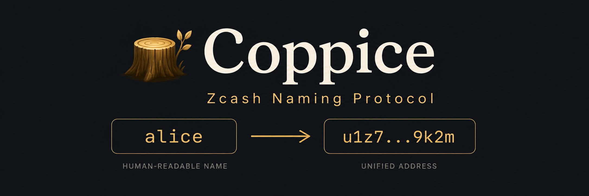

<p align="center">
  
</p>

# Coppice 🪵

**Coppice**. A native privacy-preserving naming protocol for Zcash. Zcash.

Coppice is a cryptographically self-verifying Zcash namespace, built from private bond proofs, public nullifier liveness, and deterministic state derivation.

Wallets independently derive name state from ordered Ironwood effects and txid-tagged bulletin
carriers in Zcash history.

## Core design

- **Private bonds.** A registration includes a Halo2 `BondProof` that privately proves control of
  a sufficiently valuable Ironwood note. The note, value, commitment, position, and nullifier stay
  hidden.
- **Public liveness.** When the bonded note is spent, Zcash publishes its nullifier. Coppice derives
  the matching `bond_tag` and automatically marks the name inactive.
- **Deterministic replay.** Wallets process Ironwood effects from the activation height, fetch full
  transactions only for txid-tagged candidates, decrypt public bulletin memos, and derive the same
  authenticated `NameTree` and `SpentTagTree`.
- **Local verification.** Resolution comes from locally derived state; a resolver never accepts a
  bond tag or registry answer as an external authority.

## Current protocol actions

`COMMIT` / `REVEAL` registers a name with a private bond; `UPDATE` changes its Unified Address;
`RELEASE` makes it available again; and `TRANSFER_WITH_NEW_BOND` changes ownership while replacing
the bond. A transfer to the same owner is the canonical rebond operation.

## Mainnet Rendez-vous

Reserved documentation values only; the current software does not enable a mainnet deployment.

UA:
`u1nmegh3lae9f2gpunxk2vjmdwcwdjhn2f253qa0dh7y3906qhwqyfwg045lmdldzyg6vaf6gwecn96pzpw7j9eeqca0n7x42z4cwnc5tt`
UIVK:
`uivk160lqkxdtmf23gnxanr7glczmvpuyuv737mxxm6770qgrflxmqmz63g5puuexyhwrju5l5jhkrwlumn4krgkmgttuydy5yzhs6ufq6d5yhqu2p2hv6txrhepxp7z93m2f9wsq6jlnms`
Birthday:
`TBD at mainnet launch`

## Regtest Rendez-vous

The local Z3 deployment uses a distinct public incoming capability. The strings use the Zcash
test-network encoding because regtest shares its address network type.

UA:
`utest124v8xy3mvghl0pnkf46js346xczxqyrzv8dpzqw7f0qtjhq9vgads26eq5e37rjacy58688mymhhltysn8tfgv6m6q3yhxstcyqp3hzv`
UIVK:
`uivktest1v89jt8yz8r8wvh0l8x8pkh0cs8ylx9ruer7har0vxstj5xlj9xg43c49tugzcw70yumnfjgedcj6rxads6v430h3my0hhlzkngfhrensvjcfpp5379mlqvpfuel5re4h23zscvkk97`

Every regtest Coppice carrier sends its zero-valued bulletin outputs to this UA. Every replayer
uses the corresponding public UIVK; neither value grants spending authority.


## Documentation

| Document | Purpose |
| --- | --- |
| [Protocol and developer guide](PROTOCOL.md) | Architecture, trust model, validation, development, playgrounds, and regtest workflow. |
| [Reference semantics](REFERENCE.md) | Exact encodings, hash domains, replay rules, tree semantics, and state commitments. |
| [Dependency patches](DEPENDENCY_PATCHES.md) | Required non-consensus Orchard and wallet-layer API changes. |
| [Test vectors](test-vectors/reference-v0.json) | Stable exact-byte compatibility vectors. |

## Quick start

```bash
git clone https://github.com/nfl0/coppice.git
git clone https://github.com/nfl0/coppice-cli.git
cd coppice
cargo test --workspace
./coppice-playground.sh
```

The playground uses `coppice-cli` for testnet wallet operation and the `coppice` crate for all
protocol logic. It creates or reuses a dedicated testnet wallet, replays from the fixed activation
height, and supports registration, resolution, updates, releases, local inventory, and activity
watching.

For a local three-wallet exercise against Z3, see the [regtest guide](PROTOCOL.md#local-z3-regtest-playground).

## Scope

Current work focuses on a small, privacy-preserving name lifecycle: registration, update, release,
bond replacement, and automatic bond-spend invalidation. Recursive history proofs, PIR, FROST,
subnames, governance, auctions, and production wallet UX are intentionally deferred.

## License

Dual-licensed under [MIT](LICENSE-MIT) or [Apache-2.0](LICENSE-APACHE).
